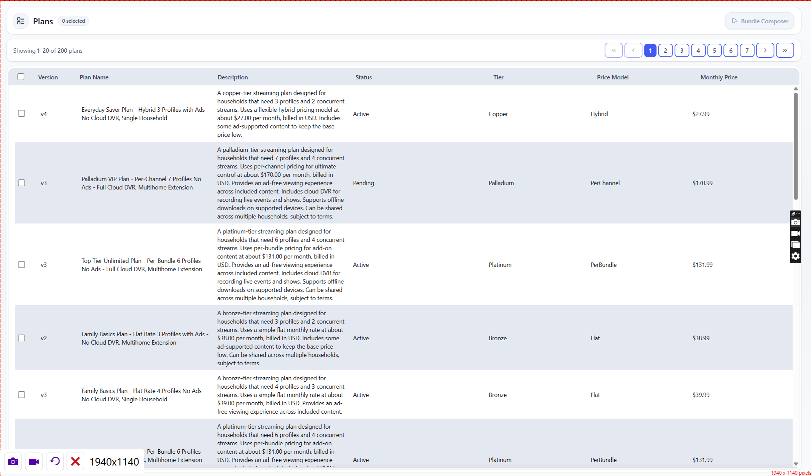
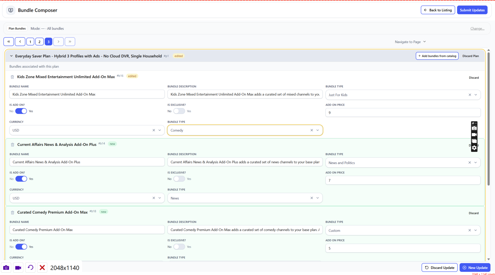

# BundleComposer

**BundleComposer is a production-style demo application that explores editing complex, interrelated data structures (Plans, Bundles, Channels) using a modern React + TypeScript architecture.**

It models a realistic bulk-editing workflow for a fictitious streaming service, where users can safely modify nested entities across multiple pages with validation, diff tracking, and predictable state transitions.

This project focuses on **maintainable frontend systems**, **data-heavy UI patterns**, and **clear architectural boundaries**, rather than visual polish or novelty features.

---

## What This Project Demonstrates

### 1. Multi-page, stateful editing workflows

Plans are edited across multiple update pages (properties, channels, bundles, etc.), with each page tracking its own dirty state and validation before allowing navigation.

### 2. Diff- and patch-based state management

User edits do not mutate original data. Instead, the UI captures structured patches per entity type (Plan, Bundle, Channel) and merges them into the rendered view.

This enables:

- predictable state transitions
- reversible changes
- safe bulk editing
- clear inspection of user intent

### 3. Performance-aware rendering for large datasets

Large collections of plans are rendered using `@tanstack/virtual`, supporting:

- custom row cards
- row-spanning cells
- dynamic height measurement
- smooth scrolling under load

### 4. Reusable, accessibility-aware UI primitives

The UI is built on Radix and shadcn/ui components, with custom Select menus and picklists designed to function correctly within virtualized layouts.

### 5. Schema-driven contracts and mock APIs

A Fastify-based mock API generates realistic data.  
The frontend consumes this data via React Query and validates it using Zod schemas to maintain strong typing and predictable data flow.

---

## Tech Stack

- **React 18**
- **TypeScript**
- **Vite**
- **pnpm**
- **Redux Toolkit** (draft / patch workflows)
- **React Query**
- **@tanstack/virtual**
- **Tailwind CSS**
- **shadcn/ui + Radix UI**
- **Fastify** (mock API server)

---

## Screenshots & Flow

### End-to-End Editing Flow


### Landing Page



### Bundle Update Page



---

## Getting Started

### Prerequisites

- Node 20+
- pnpm 9+

### Install

```bash
pnpm install
```

### Run Dev

Run API and web together:

```bash
pnpm dev
```

or separately:

```bash
pnpm dev:api     # Fastify mock server on 5175
pnpm dev:web     # React app on 3000 (Vite)
```

### Build

```bash
pnpm build
```

### Project Structure

```bash
/src
  /app         # React app, routing, layouts, components
  /server      # Fastify mock API
  /features    # Plan/Bundle/Channel editing logic
  /components  # Shared UI components
  /hooks       # Custom hooks (query, memoized logic, etc.)
  /styles      # Tailwind / global CSS
  /types       # Zod schemas & TS types
```

### Why This Project Exists

### This project showcases:

- **clean state modeling**
- **predictable diff-based editing**
- **reusable UI primitives**
- **separation of concerns**
- **virtualized, data-intensive UI patterns**
- **a well-structured React + TypeScript architecture**

### License

MIT
